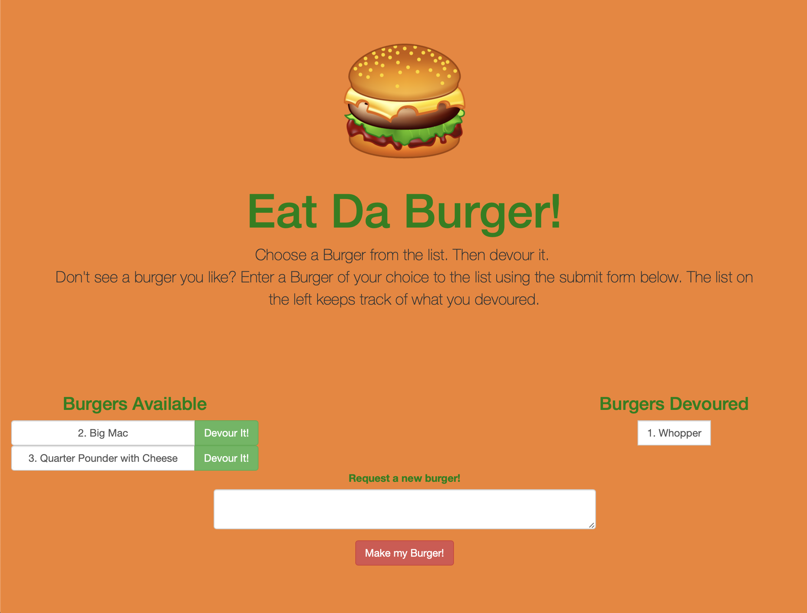

# Eat-Da-Burger!

Eat-Da-Burger! is a restaurant app that lets users input the names of burgers they'd like to eat.

## Technologies Used

* HTML/CSS
* Javascript
* Node.js
* ORM
* MySQL

## npm Packages

* [Express](https://www.npmjs.com/package/express)
* [Express-Handlebars] (https://www.npmjs.com/package/express-handlebars)
* [mysql] (https://www.npmjs.com/package/mysql)

## Getting Started 

https://immense-sands-79369.herokuapp.com/index

Once you come to the site, you can see a list of burgers available to "devour". If you don't see a burger you like, you can enter your favorite burger in the text field and select the "make a burger!" button. This will add your favorite burger to the available burgers list. Then DEVOUR IT!!!

## Screenshot

Index Page

## Author
* **JC Lenz** 